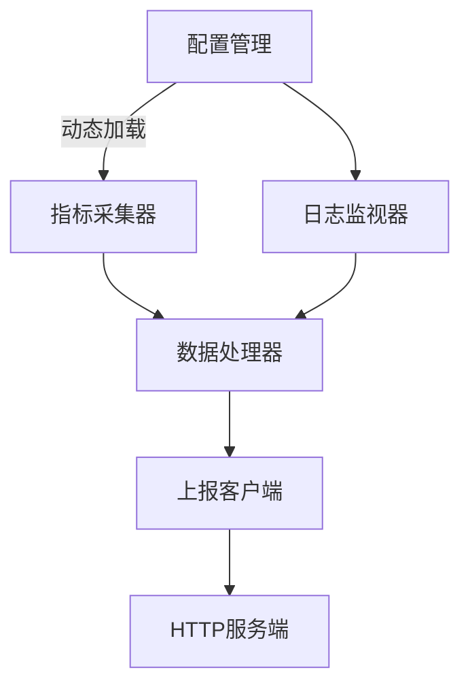

# K8s节点诊断工具设计文档

## 概述
本工具作为轻量级节点守护进程运行，通过模块化设计实现节点指标采集、日志监控、数据处理和结果上报功能。

## 架构设计


### 核心组件更新
1. **日志监视器**
   - 使用`journalctl`命令采集系统日志
   - 支持按组件过滤日志（如`--unit=kubelet`, `--unit=containerd`）
   - 实时解析日志，匹配错误模式
   - 低资源占用设计（<5% CPU）

2. **配置加载器**
   - 新增检查项参数配置能力
   ```go
   type CheckConfig struct {
     Name   string            `json:"name"`
     Enable bool              `json:"enable"`
     Params map[string]string `json:"params"` // 动态参数
   }
   ```

3. **诊断项扩展**
   - 内核参数检查：`net.ipv4.tcp_tw_reuse`, `vm.swappiness`等
   - 进程状态检查：检测D状态进程
   - 文件描述符检查：系统/进程级
   - IO性能检查：磁盘延迟、吞吐量
   - 网络检查：连通性、DNS、端口占用

## 数据模型更新
### 配置结构
```go
type Config struct {
    MetricsInterval  time.Duration `json:"metrics_interval"`
    JournalUnits     []string      `json:"journal_units"` // 监控的systemd单元
    CheckConfigs     []CheckConfig `json:"check_configs"` // 检查项配置
    // ...其他字段保持不变...
}
```

### 检查项参数示例
```json
{
  "check_configs": [
    {
      "name": "kernel_params",
      "enable": true,
      "params": {
        "check_items": "net.ipv4.tcp_tw_reuse,vm.swappiness"
      }
    },
    {
      "name": "process_status",
      "enable": true,
      "params": {
        "max_d_state": "0",
        "critical_processes": "kubelet,containerd"
      }
    }
  ]
}
```

## 错误处理
1. **分级错误处理**：
   - 警告：可自动恢复的错误（如网络波动）
   - 错误：需要记录但可继续运行
   - 致命：不可恢复错误，进程退出

2. **错误恢复机制**：
   - 资源超限时自动降级
   - 网络故障时启用本地缓存
   - 配置文件错误时回退上一版本

## 测试策略
1. **单元测试**：
   - 配置热加载逻辑
   - 指标采集准确性
   - 日志解析正确性

2. **集成测试**：
   - 全流程数据采集处理上报
   - 资源限制场景测试
   - 网络故障模拟测试

3. **性能测试**：
   - 高负载节点下的资源占用
   - 大规模日志文件的处理能力
   - 配置更新响应延迟