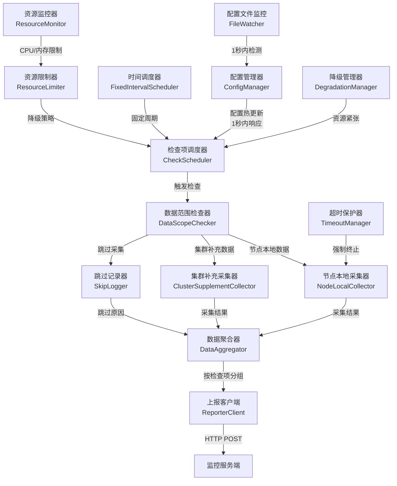
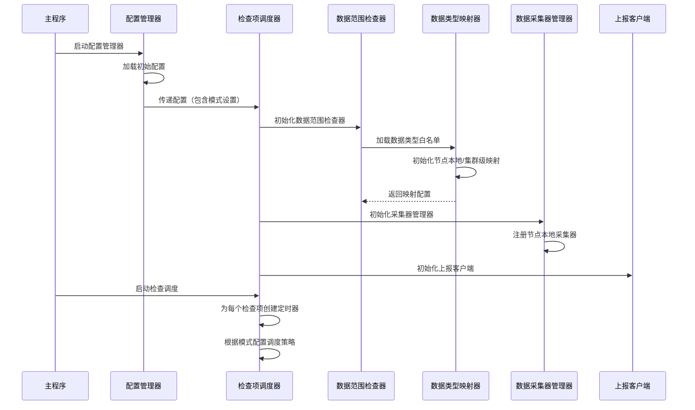
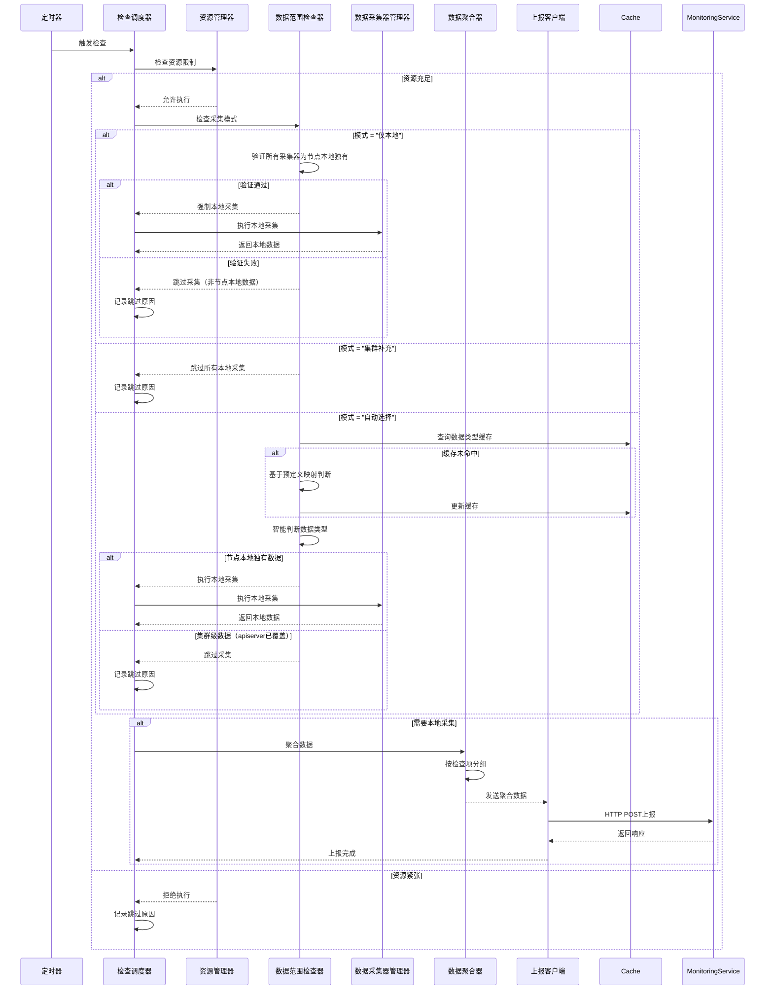
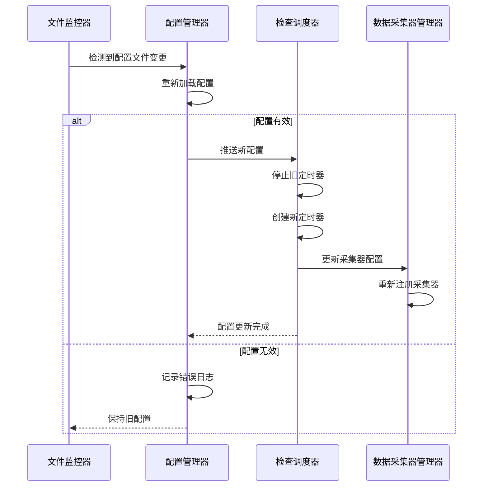
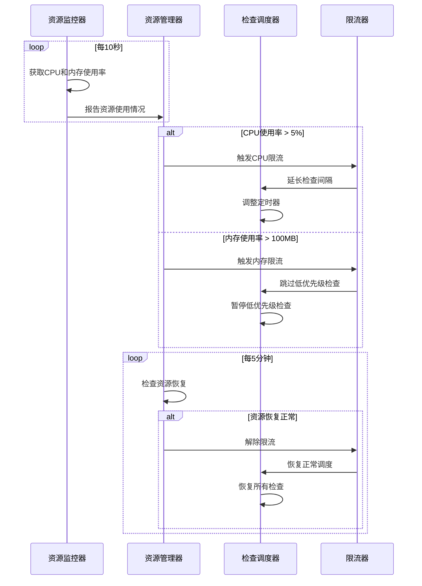
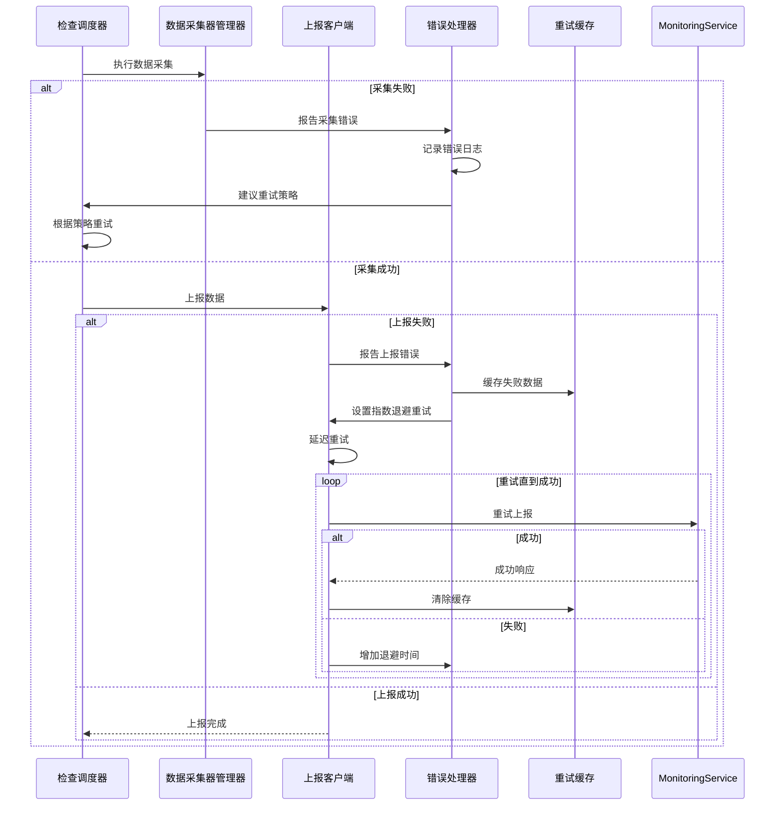
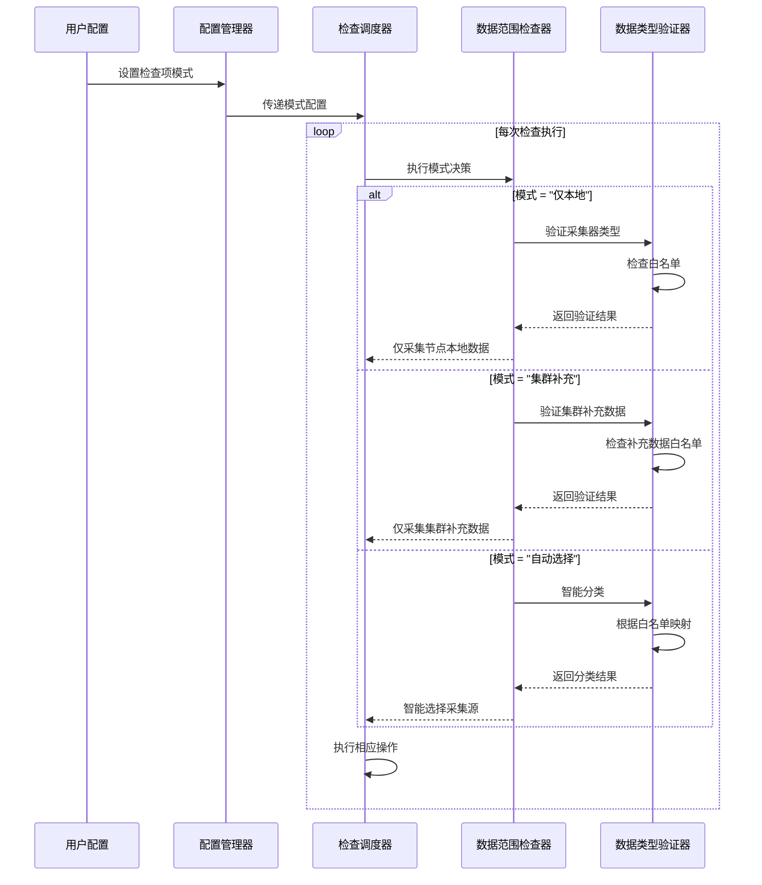

# K8s节点诊断工具设计文档

## 概述
本工具作为轻量级节点守护进程运行，采用**配置驱动架构**实现节点健康诊断。通过**检查项与数据采集功能解耦**的设计，支持灵活配置和扩展，确保最小内存占用和固定周期采集。工具专注于**节点本地独有数据**的采集，通过**数据范围模式**避免与集群级监控重复。

核心设计原则：
- **节点本地执行**：所有检查命令在节点本地执行，**完全不依赖apiserver**
- **配置驱动**：通过配置文件精确控制采集行为，支持热更新
- **轻量级**：CPU使用率<5%，内存使用<100MB
- **数据去重**：基于数据范围模式智能识别节点本地独有数据
- **解耦设计**：检查项定义与数据采集功能完全分离
- **固定周期**：严格按照配置周期执行，不受资源影响

## 架构设计

### 核心架构图


### 架构原则
1. **节点本地执行**：所有检查命令在节点本地执行，**完全不依赖apiserver**
2. **配置驱动**：所有行为由配置文件精确控制，支持热更新
3. **最小内存**：顺序处理，避免并发，时间换空间
4. **解耦设计**：检查项定义与数据采集功能完全分离
5. **固定周期**：严格按照配置周期执行，不受资源影响
6. **数据分类**：基于数据范围模式智能识别节点本地独有数据
7. **资源保护**：严格的资源使用限制和降级机制

## 组件设计

### 1. 配置管理器 (ConfigManager)
```go
type ConfigManager struct {
    configPath    string
    current       *Config
    watcher       *fsnotify.Watcher
    lastLoadTime  time.Time
    reloadMutex   sync.Mutex
}

type Config struct {
    Version        string        `json:"version"`          // 配置版本
    Checks         []CheckConfig `json:"checks"`           // 仅包含启用的检查项
    ResourceLimits ResourceLimits `json:"resource_limits"`
    DataScope      DataScopeConfig `json:"data_scope"`      // 数据范围配置
    Reporter       ReporterConfig `json:"reporter"`
}

type CheckConfig struct {
    Name        string        `json:"name"`              // 检查项名称
    Interval    time.Duration `json:"interval"`          // 固定周期：1-60分钟
    Collectors  []string      `json:"collectors"`        // 引用的采集功能ID
    Params      map[string]interface{} `json:"params"`     // 采集参数
    Mode        string        `json:"mode"`              // "仅本地", "集群补充", "自动选择"
    Enabled     bool          `json:"enabled"`           // 启用/禁用开关
    Timeout     time.Duration `json:"timeout"`           // 检查超时时间
    Priority    int           `json:"priority"`          // 优先级（资源紧张时低优先级先降级）
}

type ResourceLimits struct {
    MaxCPU        float64       `json:"max_cpu_percent"`   // 最大CPU使用率：5%
    MaxMemory     int64         `json:"max_memory_mb"`     // 最大内存使用：100MB
    MinInterval   time.Duration `json:"min_interval"`      // 最小检查间隔：1分钟
    MaxConcurrent int           `json:"max_concurrent"`    // 最大并发检查数：1（顺序执行）
}

type DataScopeConfig struct {
    Mode           string   `json:"mode"`                // "仅本地", "集群补充", "自动选择"
    NodeLocalTypes []string `json:"node_local_types"`    // 节点本地独有数据类型
    SupplementTypes []string `json:"supplement_types"`   // 集群补充数据类型
    SkipTypes      []string `json:"skip_types"`          // 跳过采集的数据类型
}

type ReporterConfig struct {
    Endpoint    string        `json:"endpoint"`          // 上报端点
    Timeout     time.Duration `json:"timeout"`           // 上报超时
    MaxRetries  int           `json:"max_retries"`       // 最大重试次数
    RetryDelay  time.Duration `json:"retry_delay"`       // 重试延迟
    Compression bool          `json:"compression"`       // 是否压缩数据
}
```

### 2. 数据范围检查器 (DataScopeChecker)

根据需求17，实现**完全不依赖apiserver**的数据范围检查机制：

```go
type DataScopeChecker struct {
    nodeLocalTypes   map[string]bool // 节点本地独有数据类型
    supplementTypes  map[string]bool // 集群补充数据类型
    skipTypes        map[string]bool // 跳过采集的数据类型
    cache            *lru.Cache      // 缓存数据类型分类结果
    lastUpdate       time.Time
    updateMutex      sync.RWMutex
    mode             string          // 当前模式：仅本地、集群补充、自动选择
}

type ScopeCheckResult struct {
    ShouldCollect bool   // 是否需要在本地采集
    Reason        string // 采集或跳过的详细原因
    Source        string // 数据来源：local/supplement/skipped
    Mode          string // 当前使用的模式
    DataType      string // 数据类型分类
}

// 三种采集模式的完整实现（完全不依赖apiserver）
func (d *DataScopeChecker) ShouldCollectLocally(
    checkName string, 
    collectors []string,
    mode string,
) (*ScopeCheckResult, error) {
    // 根据需求17的三种模式进行精确控制
    switch mode {
    case "仅本地":
        // 仅采集节点本地独有数据（严格模式）
        return d.handleLocalOnlyMode(checkName, collectors)
    case "集群补充":
        // 仅采集集群监控无法提供的细节数据
        return d.handleClusterSupplementMode(checkName, collectors)
    case "自动选择":
        // 基于预定义的数据类型映射自动判断
        return d.handleAutoSelectMode(checkName, collectors)
    default:
        return nil, fmt.Errorf("invalid collection mode: %s, must be one of: 仅本地, 集群补充, 自动选择", mode)
    }
}

func (d *DataScopeChecker) handleLocalOnlyMode(
    checkName string, 
    collectors []string,
) (*ScopeCheckResult, error) {
    // 严格验证所有采集器必须是节点本地独有
    for _, collector := range collectors {
        if !d.isNodeLocalOnly(collector) {
            return &ScopeCheckResult{
                ShouldCollect: false,
                Reason: fmt.Sprintf("collector %s is not node-local-only data, rejected in 仅本地 mode", collector),
                Source: "skipped",
                Mode:   "仅本地",
                DataType: "cluster_level",
            }, nil
        }
    }
    
    return &ScopeCheckResult{
        ShouldCollect: true,
        Reason: "forced local collection for node-local-only data",
        Source: "local",
        Mode:   "仅本地",
        DataType: "node_local",
    }, nil
}

func (d *DataScopeChecker) handleClusterSupplementMode(
    checkName string, 
    collectors []string,
) (*ScopeCheckResult, error) {
    // 仅采集集群监控无法提供的细节数据
    supplementCollectors := []string{}
    
    for _, collector := range collectors {
        if d.isClusterSupplementData(collector) {
            supplementCollectors = append(supplementCollectors, collector)
        }
    }
    
    if len(supplementCollectors) > 0 {
        return &ScopeCheckResult{
            ShouldCollect: true,
            Reason: fmt.Sprintf("collecting %d cluster-supplement collectors: %v", 
                len(supplementCollectors), supplementCollectors),
            Source: "supplement",
            Mode:   "集群补充",
            DataType: "cluster_supplement",
        }, nil
    }
    
    return &ScopeCheckResult{
        ShouldCollect: false,
        Reason: "no cluster-supplement data to collect",
        Source: "skipped",
        Mode:   "集群补充",
        DataType: "cluster_level",
    }, nil
}

func (d *DataScopeChecker) handleAutoSelectMode(
    checkName string, 
    collectors []string,
) (*ScopeCheckResult, error) {
    // 检查缓存
    cacheKey := fmt.Sprintf("%s:%s", checkName, strings.Join(collectors, ","))
    if cached, ok := d.cache.Get(cacheKey); ok {
        return cached.(*ScopeCheckResult), nil
    }
    
    // 基于预定义的数据类型映射进行智能判断
    nodeLocalCollectors := []string{}
    supplementCollectors := []string{}
    
    for _, collector := range collectors {
        if d.isNodeLocalOnly(collector) {
            nodeLocalCollectors = append(nodeLocalCollectors, collector)
        } else if d.isClusterSupplementData(collector) {
            supplementCollectors = append(supplementCollectors, collector)
        } else if d.isClusterLevel(collector) {
            // 集群级数据，跳过本地采集
            continue
        } else {
            // 未知类型，默认作为节点本地处理
            nodeLocalCollectors = append(nodeLocalCollectors, collector)
        }
    }
    
    // 优先采集节点本地独有数据
    if len(nodeLocalCollectors) > 0 {
        result := &ScopeCheckResult{
            ShouldCollect: true,
            Reason: fmt.Sprintf("collecting %d node-local-only collectors: %v", 
                len(nodeLocalCollectors), nodeLocalCollectors),
            Source: "local",
            Mode:   "自动选择",
            DataType: "node_local",
        }
        d.cache.Add(cacheKey, result)
        return result, nil
    }
    
    // 其次采集集群补充数据
    if len(supplementCollectors) > 0 {
        result := &ScopeCheckResult{
            ShouldCollect: true,
            Reason: fmt.Sprintf("collecting %d cluster-supplement collectors: %v", 
                len(supplementCollectors), supplementCollectors),
            Source: "supplement",
            Mode:   "自动选择",
            DataType: "cluster_supplement",
        }
        d.cache.Add(cacheKey, result)
        return result, nil
    }
    
    // 无可采集数据
    result := &ScopeCheckResult{
        ShouldCollect: false,
        Reason: "no node-local data to collect",
        Source: "skipped",
        Mode:   "自动选择",
        DataType: "cluster_level",
    }
    d.cache.Add(cacheKey, result)
    return result, nil
}

// 节点本地独有数据类型判断（基于需求17）
func (d *DataScopeChecker) isNodeLocalOnly(collector string) bool {
    nodeLocalTypes := map[string]bool{
        // CPU相关 - 仅节点本地可见
        "cpu_throttling":     true,
        "cpu_temperature":    true,
        "cpu_frequency":      true,
        "cpu_cache_misses":   true,
        "cpu_context_switches": true,
        
        // 内存相关 - 仅节点本地可见
        "memory_fragmentation": true,
        "swap_usage":         true,
        "oom_events":         true,
        "memory_page_faults": true,
        "memory_compaction":  true,
        
        // 磁盘相关 - 仅节点本地可见
        "disk_smart":         true,
        "disk_errors":        true,
        "disk_performance":   true,
        "disk_temperature":   true,
        "disk_reallocated_sectors": true,
        
        // 网络相关 - 仅节点本地可见
        "network_interface_errors": true,
        "tcp_retransmit_rate": true,
        "network_buffer_usage": true,
        "network_dropped_packets": true,
        "network_collisions": true,
        
        // K8s组件本地状态 - 仅节点本地可见
        "kubelet_process":    true,
        "kubelet_logs":       true,
        "kubelet_cert":       true,
        "containerd_status":  true,
        "containerd_memory":  true,
        "containerd_logs":    true,
        "cni_plugin_status":  true,
        "kube_proxy_iptables": true,
        
        // 系统级 - 仅节点本地可见
        "system_load":        true,
        "file_descriptors":   true,
        "kernel_logs":        true,
        "ntp_sync":           true,
        "process_restarts":   true,
        
        // 安全相关 - 仅节点本地可见
        "cert_validity":      true,
        "file_permissions":   true,
        "audit_logs":         true,
        "suid_files":         true,
    }
    
    return nodeLocalTypes[collector]
}

// 集群补充数据类型判断
func (d *DataScopeChecker) isClusterSupplementData(collector string) bool {
    supplementTypes := map[string]bool{
        // 进程级资源使用（集群监控无法提供）
        "process_cpu_usage":      true,
        "process_memory_usage":   true,
        "process_file_descriptors": true,
        
        // 内核日志和事件
        "kernel_dmesg":           true,
        "kernel_oom_events":      true,
        "kernel_panic_logs":      true,
        
        // 本地配置文件状态
        "kubelet_config_status":  true,
        "containerd_config_status": true,
        "cni_config_status":      true,
        
        // 证书有效期（本地检查）
        "kubelet_cert_validity":  true,
        "containerd_cert_validity": true,
        "etcd_cert_validity":     true,
    }
    
    return supplementTypes[collector]
}

// 集群级数据类型判断（仅用于拒绝）
func (d *DataScopeChecker) isClusterLevel(collector string) bool {
    clusterTypes := map[string]bool{
        "node_cpu_usage":     true,
        "node_memory_usage":  true,
        "node_disk_io":       true,
        "node_network_bytes": true,
        "pod_cpu_usage":      true,
        "pod_memory_usage":   true,
        "container_cpu":      true,
        "container_memory":   true,
    }
    
    return clusterTypes[collector]
}
```

### 3. 检查项调度器 (CheckScheduler)
```go
type CheckScheduler struct {
    checks       map[string]*ScheduledCheck
    trigger      chan string // 检查项触发通道
    scopeChecker *DataScopeChecker
    collectorMgr *CollectorManager
    resourceMgr  *ResourceManager
    ctx          context.Context
    cancel       context.CancelFunc
}

type ScheduledCheck struct {
    config      *CheckConfig
    lastRun     time.Time
    nextRun     time.Time
    ticker      *time.Ticker
    skipReason  string
    retryCount  int
    lastError   error
    mutex       sync.Mutex
}

func (s *CheckScheduler) scheduleCheck(check *ScheduledCheck) {
    // 计算下次执行时间
    now := time.Now()
    nextRun := check.lastRun.Add(check.config.Interval)
    
    // 如果已经过了执行时间，立即执行
    if nextRun.Before(now) {
        nextRun = now
    }
    
    // 创建定时器
    check.ticker = time.NewTicker(nextRun.Sub(now))
    check.nextRun = nextRun
    
    go func() {
        for {
            select {
            case <-check.ticker.C:
                s.executeCheck(check)
            case <-s.ctx.Done():
                return
            }
        }
    }()
}

func (s *CheckScheduler) executeCheck(check *ScheduledCheck) {
    check.mutex.Lock()
    defer check.mutex.Unlock()
    
    // 检查资源限制
    if !s.resourceMgr.ShouldExecute() {
        check.skipReason = "resource limit exceeded"
        return
    }
    
    // 检查数据范围
    scopeResult, err := s.scopeChecker.ShouldCollectLocally(
        check.config.Name,
        check.config.Collectors,
        check.config.Mode,
    )
    if err != nil {
        check.lastError = err
        return
    }
    
    if !scopeResult.ShouldCollect {
        check.skipReason = scopeResult.Reason
        return
    }
    
    // 执行检查
    ctx, cancel := context.WithTimeout(s.ctx, check.config.Timeout)
    defer cancel()
    
    result, err := s.collectorMgr.Collect(ctx, check.config)
    if err != nil {
        check.lastError = err
        check.retryCount++
        return
    }
    
    // 更新状态
    check.lastRun = time.Now()
    check.lastError = nil
    check.retryCount = 0
    check.skipReason = ""
}
```

### 4. 资源限制管理器 (ResourceManager)
```go
type ResourceManager struct {
    limits      ResourceLimits
    monitor     *ResourceMonitor
    throttler   *Throttler
    metrics     *ResourceMetrics
    lastCheck   time.Time
}

type ResourceMonitor struct {
    cpuUsage    float64
    memoryUsage int64
    lastUpdate  time.Time
    proc        *process.Process
}

type ResourceMetrics struct {
    totalChecks      int64
    skippedChecks    int64
    failedChecks     int64
    avgExecutionTime time.Duration
    lastUpdate       time.Time
}

func (r *ResourceManager) ShouldExecute() bool {
    r.updateMetrics()
    
    // 检查CPU使用率
    if r.monitor.cpuUsage > r.limits.MaxCPU {
        r.throttler.ThrottleCPU()
        return false
    }
    
    // 检查内存使用率
    if r.monitor.memoryUsage > r.limits.MaxMemory {
        r.throttler.ThrottleMemory()
        return false
    }
    
    return true
}

func (r *ResourceManager) updateMetrics() {
    now := time.Now()
    if now.Sub(r.lastCheck) < time.Second {
        return
    }
    
    // 获取当前进程资源使用
    if r.monitor.proc != nil {
        cpuPercent, _ := r.monitor.proc.CPUPercent()
        memInfo, _ := r.monitor.proc.MemoryInfo()
        
        r.monitor.cpuUsage = cpuPercent
        if memInfo != nil {
            r.monitor.memoryUsage = int64(memInfo.RSS) / 1024 / 1024 // MB
        }
        r.monitor.lastUpdate = now
    }
    
    r.lastCheck = now
}

type Throttler struct {
    minInterval     time.Duration
    lastExecution   map[string]time.Time
    throttleLevel   int // 0:正常, 1:轻度, 2:重度
    lastThrottle    time.Time
    mutex           sync.RWMutex
}

func (t *Throttler) ThrottleCPU() {
    t.mutex.Lock()
    defer t.mutex.Unlock()
    
    t.throttleLevel = 1
    t.lastThrottle = time.Now()
    
    // 延长检查间隔
    t.minInterval = t.minInterval * 2
    if t.minInterval > 30*time.Minute {
        t.minInterval = 30 * time.Minute
    }
}

func (t *Throttler) ThrottleMemory() {
    t.mutex.Lock()
    defer t.mutex.Unlock()
    
    t.throttleLevel = 2
    t.lastThrottle = time.Now()
    
    // 跳过非关键检查项
    t.minInterval = t.minInterval * 3
    if t.minInterval > 60*time.Minute {
        t.minInterval = 60 * time.Minute
    }
}
```

### 5. 数据采集器管理器 (CollectorManager)
```go
type CollectorManager struct {
    collectors   map[string]Collector // 采集功能注册表
    cache        *ResultCache        // 采集结果缓存
    timeoutMgr   *TimeoutManager     // 超时保护
    metrics      *CollectorMetrics   // 采集器指标
    resultPool   *sync.Pool          // 结果对象池
}

type Collector interface {
    Collect(ctx context.Context, params map[string]interface{}) (interface{}, error)
    ID() string
    IsLocalOnly() bool // 是否为节点本地独有数据
    RequiredPermissions() []string // 所需权限
    Description() string // 采集器描述
}

// 节点本地独有采集器实现
type NodeLocalMetricsCollector struct {
    procPath string
}

func (c *NodeLocalMetricsCollector) Collect(ctx context.Context, params map[string]interface{}) (interface{}, error) {
    // 采集节点本地独有指标
    result := &NodeLocalMetrics{
        CPUTemperature:  c.getCPUTemperature(),
        CPUFrequency:    c.getCPUFrequency(),
        CPUThrottling:   c.getCPUThrottling(),
        MemoryFragmentation: c.getMemoryFragmentation(),
        SwapUsage:       c.getSwapUsage(),
    }
    return result, nil
}

type NodeLocalLogCollector struct {
    logPath string
}

func (c *NodeLocalLogCollector) Collect(ctx context.Context, params map[string]interface{}) (interface{}, error) {
    // 采集节点本地独有日志
    level := params["log_level"].(string)
    since := params["since"].(time.Duration)
    
    logs, err := c.collectLogs(level, since)
    if err != nil {
        return nil, err
    }
    
    return &NodeLocalLogs{
        Level: level,
        Logs:  logs,
        Count: len(logs),
    }, nil
}

type NodeLocalProcessCollector struct {
    procPath string
}

func (c *NodeLocalProcessCollector) Collect(ctx context.Context, params map[string]interface{}) (interface{}, error) {
    // 采集节点本地进程状态
    processes := c.getProcessStatus()
    return &NodeLocalProcesses{
        Processes: processes,
        Total:     len(processes),
    }, nil
}

// 缓存机制
type ResultCache struct {
    cache      *lru.Cache
    ttl        time.Duration
    maxSize    int64
    currentSize int64
    mutex      sync.RWMutex
}

func (c *ResultCache) Get(key string) (interface{}, bool) {
    c.mutex.RLock()
    defer c.mutex.RUnlock()
    
    if val, ok := c.cache.Get(key); ok {
        entry := val.(*cacheEntry)
        if time.Since(entry.timestamp) < c.ttl {
            return entry.value, true
        }
        c.cache.Remove(key)
    }
    return nil, false
}

type cacheEntry struct {
    value     interface{}
    timestamp time.Time
    size      int64
}
```

### 6. 超时保护器 (TimeoutManager)
```go
type TimeoutManager struct {
    defaultTimeout    time.Duration
    maxExecutionTime  map[string]time.Duration
    activeExecutions  map[string]*executionContext
    mutex            sync.RWMutex
}

type executionContext struct {
    ctx     context.Context
    cancel  context.CancelFunc
    start   time.Time
    check   string
}

func (t *TimeoutManager) ExecuteWithTimeout(
    checkName string, 
    fn func() error,
) error {
    timeout := t.getTimeout(checkName)
    
    ctx, cancel := context.WithTimeout(context.Background(), timeout)
    defer cancel()
    
    execCtx := &executionContext{
        ctx:    ctx,
        cancel: cancel,
        start:  time.Now(),
        check:  checkName,
    }
    
    t.mutex.Lock()
    t.activeExecutions[checkName] = execCtx
    t.mutex.Unlock()
    
    defer func() {
        t.mutex.Lock()
        delete(t.activeExecutions, checkName)
        t.mutex.Unlock()
    }()
    
    done := make(chan error, 1)
    go func() {
        done <- fn()
    }()
    
    select {
    case err := <-done:
        return err
    case <-ctx.Done():
        return fmt.Errorf("check %s timeout after %v", checkName, timeout)
    }
}

func (t *TimeoutManager) getTimeout(checkName string) time.Duration {
    if timeout, ok := t.maxExecutionTime[checkName]; ok {
        return timeout
    }
    return t.defaultTimeout
}
```

## 数据模型

### 配置结构
```json
{
  "version": "1.0",
  "checks": [
    {
      "name": "node_cpu_local",
      "interval": "5m",
      "mode": "仅本地",
      "collectors": ["cpu_throttling", "cpu_temperature", "cpu_frequency"],
      "params": {
        "temperature_threshold": 80,
        "throttling_threshold": 100
      },
      "enabled": true,
      "timeout": "30s",
      "priority": 1
    },
    {
      "name": "kubelet_health",
      "interval": "1m",
      "mode": "自动选择",
      "collectors": ["kubelet_process", "kubelet_logs", "kubelet_cert"],
      "params": {
        "log_level": "error",
        "cert_warning_days": 30
      },
      "enabled": true,
      "timeout": "15s",
      "priority": 2
    }
  ],
  "resource_limits": {
    "max_cpu_percent": 5,
    "max_memory_mb": 100,
    "min_interval": "1m",
    "max_concurrent": 1
  },
  "data_scope": {
    "mode": "自动选择",
    "node_local_types": ["cpu_throttling", "cpu_temperature", "memory_fragmentation"],
    "supplement_types": ["process_cpu_usage", "kernel_dmesg"],
    "skip_types": ["node_cpu_usage", "node_memory_usage"]
  },
  "reporter": {
    "endpoint": "http://monitoring-service:8080/api/v1/diagnostics",
    "timeout": "10s",
    "max_retries": 3,
    "retry_delay": "5s",
    "compression": true
  }
}
```

### 节点本地独有数据定义
```go
// 节点本地独有指标 - 按类别分组
var nodeLocalOnlyMetrics = map[string]map[string]bool{
    "cpu": {
        "cpu_throttling_events":     true,
        "cpu_temperature_celsius":   true,
        "cpu_frequency_mhz":         true,
        "cpu_cache_misses":          true,
        "cpu_context_switches":      true,
    },
    "memory": {
        "memory_fragmentation":      true,
        "swap_usage_percent":        true,
        "oom_killer_events":         true,
        "memory_page_faults":        true,
        "memory_compaction":         true,
    },
    "disk": {
        "disk_io_latency_ms":        true,
        "disk_smart_status":         true,
        "disk_error_count":          true,
        "disk_temperature":          true,
        "disk_reallocated_sectors":  true,
    },
    "network": {
        "network_interface_errors":  true,
        "tcp_retransmit_rate":       true,
        "network_buffer_usage":      true,
        "network_dropped_packets":   true,
        "network_collisions":        true,
    },
    "kubernetes": {
        "kubelet_process_status":    true,
        "kubelet_cert_expiry_days":  true,
        "containerd_memory_mb":      true,
        "cni_plugin_status":         true,
        "kube_proxy_iptables_rules": true,
    },
    "system": {
        "system_load_average":       true,
        "file_descriptors_usage":    true,
        "process_restart_count":     true,
        "kernel_log_errors":         true,
        "ntp_sync_status":           true,
    },
}

// 检查项到采集功能的映射
var checkToCollectors = map[string][]string{
    "node_cpu_local":         {"cpu_throttling", "cpu_temperature", "cpu_frequency"},
    "node_memory_local":      {"memory_fragmentation", "swap_usage", "oom_events"},
    "node_disk_local":        {"disk_smart", "disk_errors", "disk_performance"},
    "node_network_local":     {"network_errors", "tcp_stats", "interface_status"},
    "kubelet_health":         {"kubelet_process", "kubelet_logs", "kubelet_cert"},
    "container_runtime":      {"containerd_status", "containerd_memory", "containerd_logs"},
    "system_health":          {"system_load", "file_descriptors", "kernel_logs"},
    "security_check":         {"cert_validity", "file_permissions", "audit_logs"},
}
```

### 数据类型白名单详细定义

根据需求17，提供完整的数据类型映射：

```go
// 节点本地独有数据类型定义（需求17要求）
var NodeLocalDataTypeMapping = map[string]DataTypeInfo{
    // CPU类 - 仅节点本地可见
    "cpu_throttling": {
        Category:    "cpu",
        Type:        "node_local",
        Description: "CPU throttling事件详情、CPU温度、CPU频率变化",
        Examples:    []string{"cpu_throttle_events", "cpu_temperature_celsius", "cpu_frequency_mhz"},
    },
    
    // 内存类 - 仅节点本地可见
    "memory_fragmentation": {
        Category:    "memory",
        Type:        "node_local",
        Description: "内存碎片指标、swap使用率、OOM killer事件详情",
        Examples:    []string{"memory_fragmentation_ratio", "swap_usage_percent", "oom_killer_events"},
    },
    
    // 磁盘类 - 仅节点本地可见
    "disk_smart": {
        Category:    "disk",
        Type:        "node_local",
        Description: "磁盘I/O延迟分布、磁盘错误日志、SMART状态",
        Examples:    []string{"disk_io_latency_ms", "disk_smart_status", "disk_error_count"},
    },
    
    // 网络类 - 仅节点本地可见
    "network_interface_errors": {
        Category:    "network",
        Type:        "node_local",
        Description: "网络接口错误统计、TCP重传率、网络缓冲区状态",
        Examples:    []string{"network_interface_errors", "tcp_retransmit_rate", "network_buffer_usage"},
    },
    
    // K8s组件本地状态
    "kubelet_local": {
        Category:    "kubernetes",
        Type:        "node_local",
        Description: "kubelet进程状态、kubelet日志错误、kubelet配置文件完整性、kubelet证书有效期",
        Examples:    []string{"kubelet_process_status", "kubelet_log_errors", "kubelet_cert_expiry_days"},
    },
    
    // 容器运行时本地状态
    "container_runtime_local": {
        Category:    "container_runtime",
        Type:        "node_local",
        Description: "containerd/docker进程状态、运行时socket响应时间、运行时日志错误、运行时内存使用",
        Examples:    []string{"containerd_memory_mb", "containerd_socket_latency_ms", "containerd_log_errors"},
    },
    
    // 系统级本地状态
    "system_local": {
        Category:    "system",
        Type:        "node_local",
        Description: "系统负载平均值、文件描述符使用率、关键系统进程状态、内核错误日志",
        Examples:    []string{"system_load_average", "file_descriptors_usage", "kernel_log_errors"},
    },
}

// 集群级数据类型定义（apiserver已覆盖）
var ClusterLevelDataTypeMapping = map[string]DataTypeInfo{
    "node_cpu_usage": {
        Category:    "cpu",
        Type:        "cluster_level",
        Description: "节点CPU使用率（apiserver已提供）",
        Examples:    []string{"node_cpu_usage_total", "node_cpu_usage_percent"},
    },
    
    "node_memory_usage": {
        Category:    "memory",
        Type:        "cluster_level",
        Description: "节点内存使用率（apiserver已提供）",
        Examples:    []string{"node_memory_usage_bytes", "node_memory_usage_percent"},
    },
    
    "node_disk_io": {
        Category:    "disk",
        Type:        "cluster_level",
        Description: "节点磁盘I/O统计（apiserver已提供）",
        Examples:    []string{"node_disk_io_time_seconds_total", "node_disk_read_bytes_total"},
    },
    
    "node_network_bytes": {
        Category:    "network",
        Type:        "cluster_level",
        Description: "节点网络流量统计（apiserver已提供）",
        Examples:    []string{"node_network_receive_bytes_total", "node_network_transmit_bytes_total"},
    },
}

type DataTypeInfo struct {
    Category    string   `json:"category"`
    Type        string   `json:"type"` // "node_local" 或 "cluster_level"
    Description string   `json:"description"`
    Examples    []string `json:"examples"`
}
```

## 轻量级设计策略

### 1. 内存优化
- **对象池化**：使用sync.Pool复用临时对象，减少GC压力
- **固定缓存**：预分配固定大小缓存，避免动态扩容
- **数据流处理**：边采集边处理，避免大量数据驻留内存
- **零拷贝**：直接读取/proc和/sys文件，避免中间转换
- **内存映射**：使用mmap读取大文件，减少内存占用

```go
// 内存优化示例
type MemoryPool struct {
    bufferPool sync.Pool
    stringPool sync.Pool
}

func (p *MemoryPool) GetBuffer() *bytes.Buffer {
    if v := p.bufferPool.Get(); v != nil {
        buf := v.(*bytes.Buffer)
        buf.Reset()
        return buf
    }
    return bytes.NewBuffer(make([]byte, 0, 1024))
}

func (p *MemoryPool) PutBuffer(buf *bytes.Buffer) {
    if buf.Cap() <= 4096 { // 限制最大缓存大小
        p.bufferPool.Put(buf)
    }
}
```

### 2. CPU优化
- **时间片调度**：使用time.Ticker精确控制采集间隔
- **避免忙等待**：sleep而非轮询
- **复用采集结果**：同一采集功能结果被多个检查项共享
- **智能跳过**：集群级数据直接跳过
- **批处理**：合并多个相似操作，减少系统调用

```go
// CPU优化示例
type CPUOptimizer struct {
    ticker       *time.Ticker
    lastExecution map[string]time.Time
    batchSize    int
}

func (c *CPUOptimizer) ScheduleBatch(checks []string) {
    // 合并相似检查，减少系统调用
    batch := c.groupSimilarChecks(checks)
    for _, group := range batch {
        go c.executeBatch(group)
    }
}
```

### 3. 存储优化
- **增量更新**：只处理变化的数据
- **本地缓存**：失败时暂存到本地文件，指数退避重试
- **压缩存储**：上报前压缩数据，减少网络传输
- **日志轮转**：自动清理过期日志文件

```go
// 存储优化示例
type StorageOptimizer struct {
    cacheDir     string
    maxCacheSize int64
    currentSize  int64
    mutex        sync.RWMutex
}

func (s *StorageOptimizer) CacheData(key string, data []byte) error {
    s.mutex.Lock()
    defer s.mutex.Unlock()
    
    // 检查缓存大小限制
    if s.currentSize+int64(len(data)) > s.maxCacheSize {
        s.cleanupOldCache()
    }
    
    // 压缩数据
    compressed := compress(data)
    
    // 写入缓存
    return s.writeCache(key, compressed)
}
```

### 4. 资源限制机制
```go
// 资源监控
type ResourceLimiter struct {
    cpuLimiter    *rate.Limiter
    memoryTracker *MemoryTracker
    lastCheck     time.Time
}

func (r *ResourceLimiter) MonitorResources() {
    ticker := time.NewTicker(10 * time.Second)
    defer ticker.Stop()
    
    for range ticker.C {
        cpu := r.getCPUUsage()
        mem := r.getMemoryUsage()
        
        if cpu > 5.0 || mem > 100 {
            r.applyThrottling()
        }
    }
}

// 自动降级
type DegradationManager struct {
    level        int // 0:正常, 1:轻度, 2:中度, 3:重度
    lastDegrade  time.Time
    checkPriorities map[string]int
}

func (d *DegradationManager) Degrade() {
    d.level++
    d.lastDegrade = time.Now()
    
    switch d.level {
    case 1:
        // 轻度：延长检查间隔
        d.extendIntervals(1.5)
    case 2:
        // 中度：跳过低优先级检查
        d.skipLowPriorityChecks()
    case 3:
        // 重度：仅保留关键检查
        d.retainCriticalChecksOnly()
    }
}
```

## 扩展机制

### 1. 检查项扩展
通过配置添加新检查项，无需代码修改：

```json
{
  "name": "custom_security_check",
  "interval": "10m",
  "mode": "仅本地",
  "collectors": ["file_permissions", "suid_files", "audit_logs"],
  "params": {
    "sensitive_paths": ["/etc/kubernetes", "/var/lib/kubelet"],
    "permission_mask": "600",
    "audit_patterns": ["authentication", "authorization"]
  },
  "enabled": true,
  "timeout": "60s",
  "priority": 4
}
```

### 2. 采集功能扩展
插件式采集器注册：

```go
// 采集器注册接口
type CollectorRegistry struct {
    collectors map[string]Collector
    mutex      sync.RWMutex
}

func (r *CollectorRegistry) Register(id string, collector Collector) error {
    r.mutex.Lock()
    defer r.mutex.Unlock()
    
    if _, exists := r.collectors[id]; exists {
        return fmt.Errorf("collector %s already registered", id)
    }
    
    r.collectors[id] = collector
    return nil
}

// 示例：新的节点本地采集器
type ContainerSecurityCollector struct {
    containerdSocket string
}

func (c *ContainerSecurityCollector) Collect(ctx context.Context, params map[string]interface{}) (interface{}, error) {
    // 实现容器安全检查逻辑
    sensitivePaths := params["sensitive_paths"].([]string)
    results := make(map[string]SecurityCheckResult)
    
    for _, path := range sensitivePaths {
        result, err := c.checkContainerSecurity(path)
        if err != nil {
            continue
        }
        results[path] = result
    }
    
    return &ContainerSecurityReport{
        Checks: results,
        Timestamp: time.Now(),
    }, nil
}

func (c *ContainerSecurityCollector) ID() string {
    return "container_security"
}

func (c *ContainerSecurityCollector) IsLocalOnly() bool {
    return true
}

func (c *ContainerSecurityCollector) RequiredPermissions() []string {
    return []string{"read_container_config", "read_container_logs"}
}

func (c *ContainerSecurityCollector) Description() string {
    return "Collect container security configuration and logs from node local"
}
```

### 3. 配置验证机制
```go
type ConfigValidator struct {
    rules map[string]ValidationRule
}

type ValidationRule interface {
    Validate(config interface{}) error
}

func (v *ConfigValidator) ValidateConfig(config *Config) error {
    for _, check := range config.Checks {
        if err := v.validateCheck(check); err != nil {
            return fmt.Errorf("invalid check %s: %w", check.Name, err)
        }
    }
    return nil
}
```

## 错误处理

### 1. 配置错误处理
- **格式错误**：记录错误详情，保持上一个有效配置
- **参数错误**：跳过该检查项，继续执行其他项
- **缺失依赖**：标记检查项为不可用，定期重试
- **版本不兼容**：提供配置迁移提示

```go
type ConfigErrorHandler struct {
    logger      *zap.Logger
    lastValid   *Config
    errorCount  map[string]int
}

func (h *ConfigErrorHandler) HandleConfigError(err error, configPath string) {
    h.logger.Error("config error", 
        zap.String("path", configPath),
        zap.Error(err),
    )
    
    // 记录错误次数
    h.errorCount[configPath]++
    
    // 如果错误次数过多，回退到默认配置
    if h.errorCount[configPath] > 3 {
        h.useDefaultConfig()
    }
}
```

### 2. 采集错误处理
- **采集失败**：返回空结果，不影响其他采集器
- **超时处理**：设置采集超时，避免阻塞
- **资源限制**：检测到资源紧张时主动降级
- **权限错误**：记录并跳过需要特权的检查项

```go
type CollectionErrorHandler struct {
    logger      *zap.Logger
    metrics     *ErrorMetrics
    fallback    map[string]Collector
}

func (h *CollectionErrorHandler) HandleCollectionError(
    collector string, 
    err error,
) {
    h.logger.Warn("collection error",
        zap.String("collector", collector),
        zap.Error(err),
    )
    
    h.metrics.RecordError(collector, err)
    
    // 根据错误类型决定是否重试
    if h.shouldRetry(err) {
        h.scheduleRetry(collector)
    }
}
```

### 3. 上报错误处理
- **网络故障**：本地缓存数据，指数退避重试
- **服务端错误**：按错误类型决定是否重试
- **数据格式错误**：记录并跳过该批次数据
- **认证失败**：标记上报为不可用

```go
type ReporterErrorHandler struct {
    logger      *zap.Logger
    cache       *RetryCache
    backoff     *ExponentialBackoff
}

func (h *ReporterErrorHandler) HandleReportError(
    data []byte, 
    err error,
) error {
    h.logger.Error("report error", zap.Error(err))
    
    // 缓存失败数据
    if err := h.cache.Store(data); err != nil {
        return fmt.Errorf("failed to cache data: %w", err)
    }
    
    // 指数退避重试
    delay := h.backoff.NextDelay()
    time.AfterFunc(delay, func() {
        h.retryReport()
    })
    
    return nil
}
```

## 测试策略

### 1. 单元测试
- **配置解析**：验证各种配置格式的正确解析
- **采集器测试**：每个采集器的独立测试
- **数据聚合**：验证聚合逻辑的正确性
- **资源限制**：验证CPU和内存限制机制

```go
// 单元测试示例
func TestConfigParser(t *testing.T) {
    tests := []struct {
        name     string
        config   string
        expected *Config
        wantErr  bool
    }{
        {
            name: "valid config",
            config: `{"checks":[{"name":"test","interval":"5m"}]}`,
            expected: &Config{
                Checks: []CheckConfig{
                    {Name: "test", Interval: 5 * time.Minute},
                },
            },
            wantErr: false,
        },
        {
            name: "invalid interval",
            config: `{"checks":[{"name":"test","interval":"invalid"}]}`,
            wantErr: true,
        },
    }
    
    for _, tt := range tests {
        t.Run(tt.name, func(t *testing.T) {
            // 测试逻辑
        })
    }
}
```

### 2. 集成测试
- **配置热更新**：验证配置变更的1秒内响应
- **固定周期测试**：验证采集周期的精确性
- **错误恢复**：模拟各种错误场景的恢复能力
- **数据范围模式**：验证三种模式的正确切换

```go
// 集成测试示例
func TestConfigHotReload(t *testing.T) {
    // 创建临时配置文件
    tmpFile, err := os.CreateTemp("", "config-*.json")
    require.NoError(t, err)
    defer os.Remove(tmpFile.Name())
    
    // 写入初始配置
    initialConfig := `{"checks":[{"name":"test","interval":"5m"}]}`
    err = os.WriteFile(tmpFile.Name(), []byte(initialConfig), 0644)
    require.NoError(t, err)
    
    // 启动配置管理器
    manager := NewConfigManager(tmpFile.Name())
    err = manager.Start()
    require.NoError(t, err)
    defer manager.Stop()
    
    // 修改配置
    updatedConfig := `{"checks":[{"name":"test","interval":"10m"}]}`
    err = os.WriteFile(tmpFile.Name(), []byte(updatedConfig), 0644)
    require.NoError(t, err)
    
    // 验证配置在1秒内更新
    time.Sleep(1 * time.Second)
    
    config := manager.GetCurrent()
    assert.Equal(t, 10*time.Minute, config.Checks[0].Interval)
}
```

### 3. 性能测试
- **内存占用**：长时间运行的内存泄漏检测
- **CPU使用**：不同负载下的CPU占用分析
- **配置规模**：大量检查项下的性能表现
- **资源限制**：验证5% CPU和100MB内存限制

```go
// 性能测试示例
func BenchmarkMemoryUsage(b *testing.B) {
    // 创建大量检查项
    config := &Config{
        Checks: make([]CheckConfig, 1000),
    }
    
    for i := 0; i < 1000; i++ {
        config.Checks[i] = CheckConfig{
            Name:     fmt.Sprintf("check-%d", i),
            Interval: time.Minute,
            Collectors: []string{"cpu", "memory"},
        }
    }
    
    // 运行测试
    b.ResetTimer()
    for i := 0; i < b.N; i++ {
        manager := NewCollectorManager(config)
        manager.Run()
    }
    
    // 验证内存使用
    var m runtime.MemStats
    runtime.ReadMemStats(&m)
    assert.Less(b, m.Alloc/1024/1024, int64(100)) // < 100MB
}
```

### 4. 扩展性测试
- **动态注册**：验证采集器的动态注册机制
- **配置组合**：验证不同检查项组合的正确性
- **错误隔离**：验证单个检查项错误不影响其他项
- **节点本地数据**：验证仅采集节点本地独有数据

### 5. 安全测试
- **权限测试**：验证非特权用户运行能力
- **文件访问**：验证敏感文件访问控制
- **网络安全**：验证网络连接超时和重试机制

```go
// 安全测试示例
func TestPermissionHandling(t *testing.T) {
    // 以非特权用户运行
    if os.Geteuid() == 0 {
        t.Skip("must run as non-root user")
    }
    
    collector := NewPrivilegedCollector()
    _, err := collector.Collect(context.Background(), nil)
    
    // 验证权限错误被正确处理
    assert.Error(t, err)
    assert.Contains(t, err.Error(), "permission denied")
}
```

## 部署与运维

### 1. 部署方式
- **二进制部署**：单文件可执行程序
- **容器部署**：轻量级容器镜像
- **系统服务**：systemd服务配置

### 2. 运维接口
- **健康检查**：HTTP健康检查端点
- **指标暴露**：Prometheus格式指标
- **配置重载**：SIGHUP信号触发配置重载

### 3. 监控告警
- **资源使用**：CPU、内存使用率告警
- **检查失败**：检查项失败次数告警
- **配置错误**：配置加载失败告警

## 时序图

### 1. 系统初始化时序图


### 2. 单次检查执行时序图


### 3. 配置热更新时序图


### 4. 资源限制和降级时序图


### 5. 错误处理和重试时序图


### 6. 数据范围模式完整流程时序图


这些时序图与架构图和组件设计相互补充，帮助理解系统的运行时行为和各个组件之间的交互关系，确保与需求文档中的17个需求完全一致。