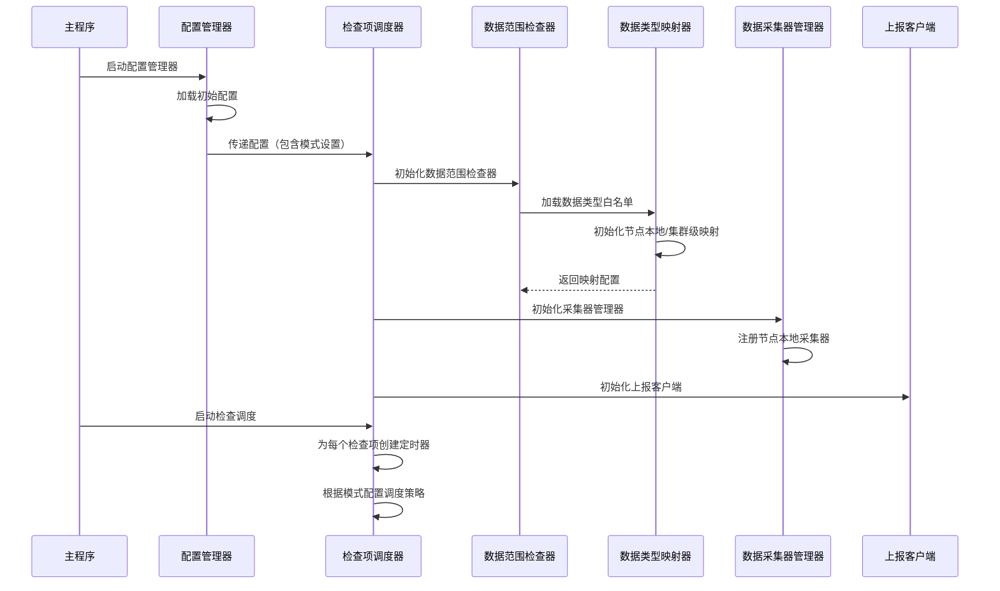
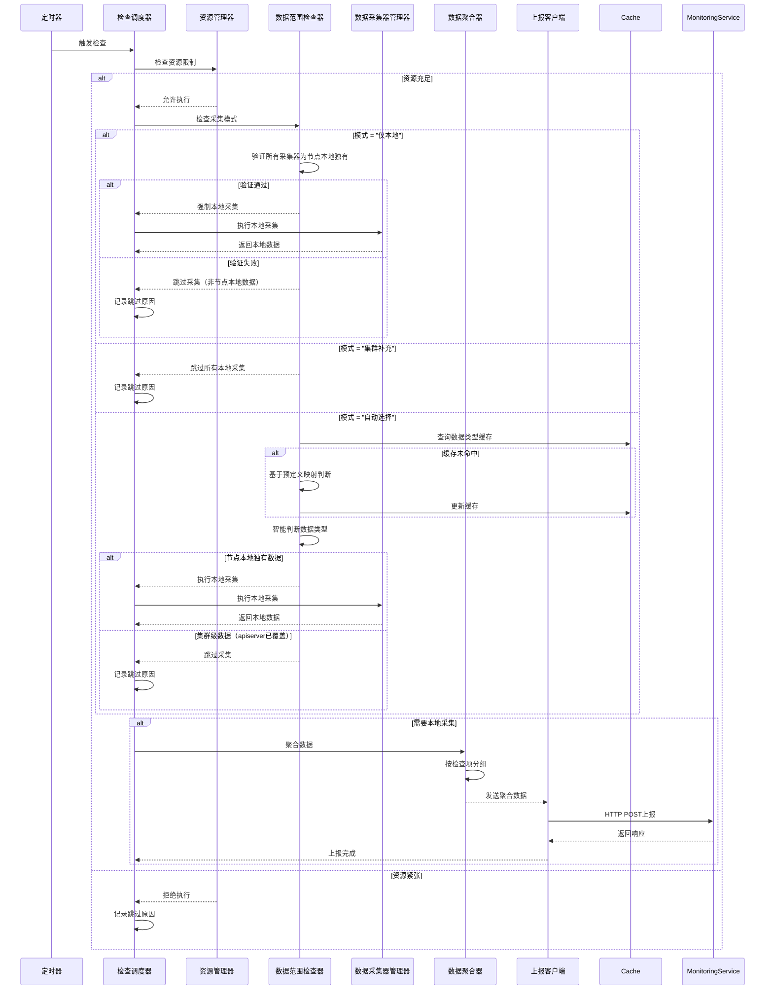
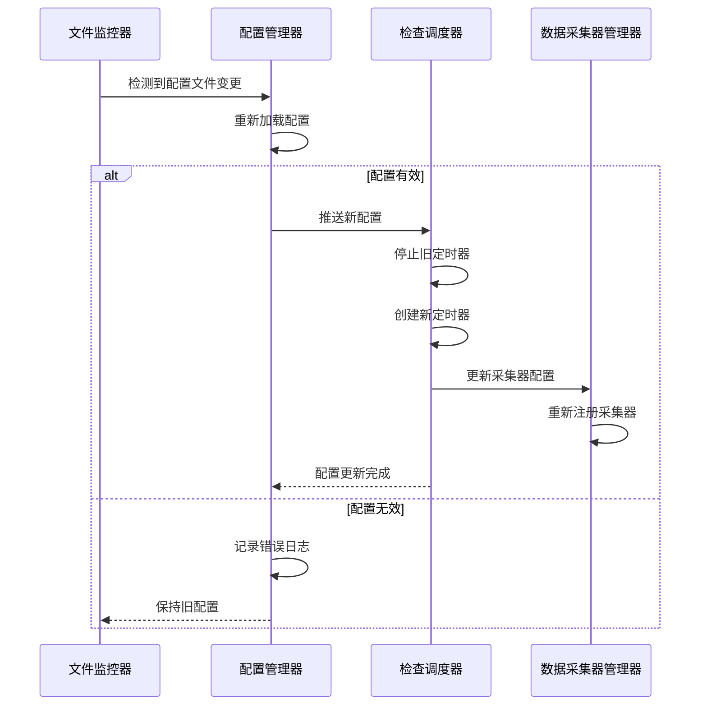
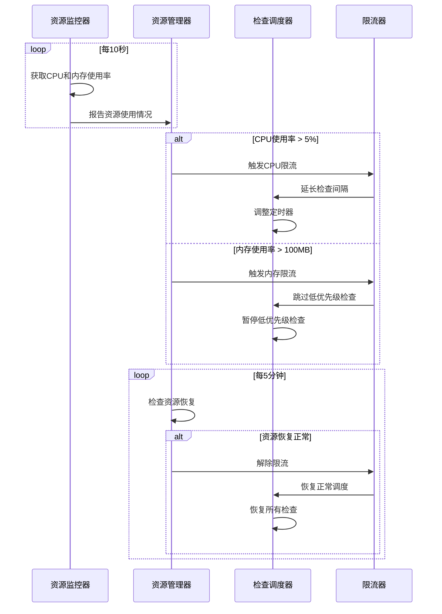
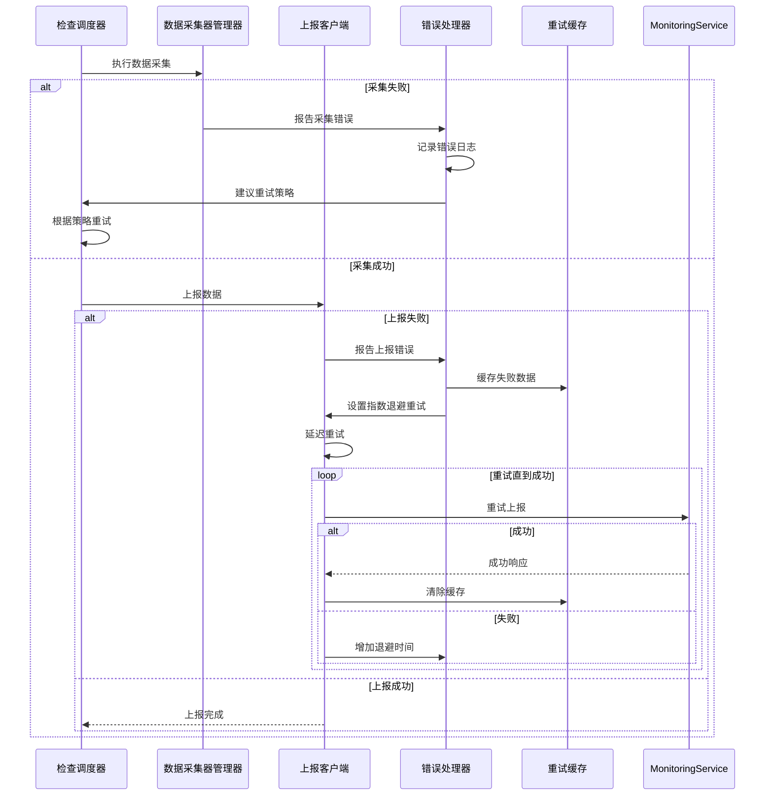
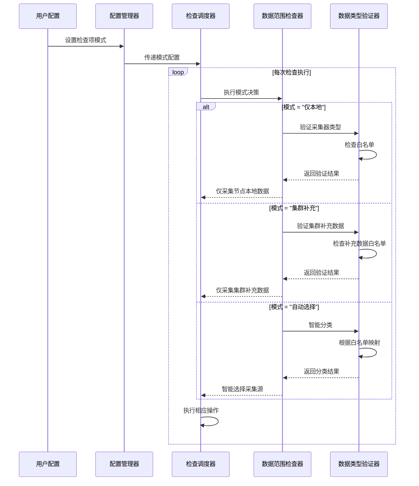

# 时序图

## 1. 系统初始化时序图

```mermaid
sequenceDiagram
    participant Main as 主程序
    participant ConfigManager as 配置管理器
    participant CheckScheduler as 检查项调度器
    participant DataScopeChecker as 数据范围检查器
    participant DataTypeMapper as 数据类型映射器
    participant CollectorManager as 数据采集器管理器
    participant ReporterClient as 上报客户端
    
    Main->>ConfigManager: 启动配置管理器
    ConfigManager->>ConfigManager: 加载初始配置
    ConfigManager->>CheckScheduler: 传递配置（包含模式设置）
    CheckScheduler->>DataScopeChecker: 初始化数据范围检查器
    DataScopeChecker->>DataTypeMapper: 加载数据类型白名单
    DataTypeMapper->>DataTypeMapper: 初始化节点本地/集群级映射
    DataTypeMapper-->>DataScopeChecker: 返回映射配置
    CheckScheduler->>CollectorManager: 初始化采集器管理器
    CollectorManager->>CollectorManager: 注册节点本地采集器
    CheckScheduler->>ReporterClient: 初始化上报客户端
    Main->>CheckScheduler: 启动检查调度
    CheckScheduler->>CheckScheduler: 为每个检查项创建定时器
    CheckScheduler->>CheckScheduler: 根据模式配置调度策略
```

## 2. 单次检查执行时序图

```mermaid
sequenceDiagram
    participant Timer as 定时器
    participant CheckScheduler as 检查调度器
    participant ResourceManager as 资源管理器
    participant DataScopeChecker as 数据范围检查器
    participant CollectorManager as 数据采集器管理器
    participant DataAggregator as 数据聚合器
    participant ReporterClient as 上报客户端
    
    Timer->>CheckScheduler: 触发检查
    CheckScheduler->>ResourceManager: 检查资源限制
    alt 资源充足
        ResourceManager-->>CheckScheduler: 允许执行
        CheckScheduler->>DataScopeChecker: 检查采集模式
        
        alt 模式 = "仅本地"
            DataScopeChecker->>DataScopeChecker: 验证所有采集器为节点本地独有
            alt 验证通过
                DataScopeChecker-->>CheckScheduler: 强制本地采集
                CheckScheduler->>CollectorManager: 执行本地采集
                CollectorManager-->>CheckScheduler: 返回本地数据
            else 验证失败
                DataScopeChecker-->>CheckScheduler: 跳过采集（非节点本地数据）
                CheckScheduler->>CheckScheduler: 记录跳过原因
            end
            
        else 模式 = "集群补充"
            DataScopeChecker-->>CheckScheduler: 跳过所有本地采集
            CheckScheduler->>CheckScheduler: 记录跳过原因
            
        else 模式 = "自动选择"
            DataScopeChecker->>Cache: 查询数据类型缓存
            alt 缓存未命中
                DataScopeChecker->>DataScopeChecker: 基于预定义映射判断
                DataScopeChecker->>Cache: 更新缓存
            end
            
            DataScopeChecker->>DataScopeChecker: 智能判断数据类型
            alt 节点本地独有数据
                DataScopeChecker-->>CheckScheduler: 执行本地采集
                CheckScheduler->>CollectorManager: 执行本地采集
                CollectorManager-->>CheckScheduler: 返回本地数据
            else 集群级数据（apiserver已覆盖）
                DataScopeChecker-->>CheckScheduler: 跳过采集
                CheckScheduler->>CheckScheduler: 记录跳过原因
            end
        end
        
        alt 需要本地采集
            CheckScheduler->>DataAggregator: 聚合数据
            DataAggregator->>DataAggregator: 按检查项分组
            DataAggregator-->>ReporterClient: 发送聚合数据
            ReporterClient->>MonitoringService: HTTP POST上报
            MonitoringService-->>ReporterClient: 返回响应
            ReporterClient-->>CheckScheduler: 上报完成
        end
        
    else 资源紧张
        ResourceManager-->>CheckScheduler: 拒绝执行
        CheckScheduler->>CheckScheduler: 记录跳过原因
    end
```

## 3. 配置热更新时序图

```mermaid
sequenceDiagram
    participant FileWatcher as 文件监控器
    participant ConfigManager as 配置管理器
    participant CheckScheduler as 检查调度器
    participant CollectorManager as 数据采集器管理器
    
    FileWatcher->>ConfigManager: 检测到配置文件变更
    ConfigManager->>ConfigManager: 重新加载配置
    alt 配置有效
        ConfigManager->>CheckScheduler: 推送新配置
        CheckScheduler->>CheckScheduler: 停止旧定时器
        CheckScheduler->>CheckScheduler: 创建新定时器
        CheckScheduler->>CollectorManager: 更新采集器配置
        CollectorManager->>CollectorManager: 重新注册采集器
        CheckScheduler-->>ConfigManager: 配置更新完成
    else 配置无效
        ConfigManager->>ConfigManager: 记录错误日志
        ConfigManager-->>FileWatcher: 保持旧配置
    end
```

## 4. 资源限制和降级时序图

```mermaid
sequenceDiagram
    participant ResourceMonitor as 资源监控器
    participant ResourceManager as 资源管理器
    participant CheckScheduler as 检查调度器
    participant Throttler as 限流器
    
    loop 每10秒
        ResourceMonitor->>ResourceMonitor: 获取CPU和内存使用率
        ResourceMonitor->>ResourceManager: 报告资源使用情况
    end
    
    alt CPU使用率 > 5%
        ResourceManager->>Throttler: 触发CPU限流
        Throttler->>CheckScheduler: 延长检查间隔
        CheckScheduler->>CheckScheduler: 调整定时器
    else 内存使用率 > 100MB
        ResourceManager->>Throttler: 触发内存限流
        Throttler->>CheckScheduler: 跳过低优先级检查
        CheckScheduler->>CheckScheduler: 暂停低优先级检查
    end
    
    loop 每5分钟
        ResourceManager->>ResourceManager: 检查资源恢复
        alt 资源恢复正常
            ResourceManager->>Throttler: 解除限流
            Throttler->>CheckScheduler: 恢复正常调度
            CheckScheduler->>CheckScheduler: 恢复所有检查
        end
    end
```

## 5. 错误处理和重试时序图

```mermaid
sequenceDiagram
    participant CheckScheduler as 检查调度器
    participant CollectorManager as 数据采集器管理器
    participant ReporterClient as 上报客户端
    participant ErrorHandler as 错误处理器
    participant RetryCache as 重试缓存
    
    CheckScheduler->>CollectorManager: 执行数据采集
    alt 采集失败
        CollectorManager->>ErrorHandler: 报告采集错误
        ErrorHandler->>ErrorHandler: 记录错误日志
        ErrorHandler->>CheckScheduler: 建议重试策略
        CheckScheduler->>CheckScheduler: 根据策略重试
    else 采集成功
        CheckScheduler->>ReporterClient: 上报数据
        alt 上报失败
            ReporterClient->>ErrorHandler: 报告上报错误
            ErrorHandler->>RetryCache: 缓存失败数据
            ErrorHandler->>ReporterClient: 设置指数退避重试
            ReporterClient->>ReporterClient: 延迟重试
            loop 重试直到成功
                ReporterClient->>MonitoringService: 重试上报
                alt 成功
                    MonitoringService-->>ReporterClient: 成功响应
                    ReporterClient->>RetryCache: 清除缓存
                else 失败
                    ReporterClient->>ErrorHandler: 增加退避时间
                end
            end
        else 上报成功
            ReporterClient-->>CheckScheduler: 上报完成
        end
    end
```

## 6. 数据范围模式完整流程时序图

```mermaid
sequenceDiagram
    participant User as 用户配置
    participant ConfigManager as 配置管理器
    participant CheckScheduler as 检查调度器
    participant DataScopeChecker as 数据范围检查器
    participant DataTypeValidator as 数据类型验证器
    
    User->>ConfigManager: 设置检查项模式
    ConfigManager->>CheckScheduler: 传递模式配置
    
    loop 每次检查执行
        CheckScheduler->>DataScopeChecker: 执行模式决策
        
        alt 模式 = "仅本地"
            DataScopeChecker->>DataTypeValidator: 验证采集器类型
            DataTypeValidator->>DataTypeValidator: 检查白名单
            DataTypeValidator-->>DataScopeChecker: 返回验证结果
            DataScopeChecker-->>CheckScheduler: 仅采集节点本地数据
            
        else 模式 = "集群补充"
            DataScopeChecker->>DataTypeValidator: 验证集群补充数据
            DataTypeValidator->>DataTypeValidator: 检查补充数据白名单
            DataTypeValidator-->>DataScopeChecker: 返回验证结果
            DataScopeChecker-->>CheckScheduler: 仅采集集群补充数据
            
        else 模式 = "自动选择"
            DataScopeChecker->>DataTypeValidator: 智能分类
            DataTypeValidator->>DataTypeValidator: 根据白名单映射
            DataTypeValidator-->>DataScopeChecker: 返回分类结果
            DataScopeChecker-->>CheckScheduler: 智能选择采集源
        end
        
        CheckScheduler->>CheckScheduler: 执行相应操作
    end
```

这些时序图与架构图和组件设计相互补充，帮助理解系统的运行时行为和各个组件之间的交互关系，确保与需求文档中的17个需求完全一致。